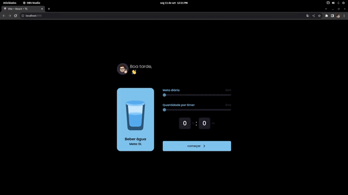

# React + TypeScript + Vite + stitches

O desafio era criar um reminder para beber água. Nesse projeto utilizo o React com stitches e pattern de composição. 
Esse desafio foi criado para o #boracodar, um projeto da Rocketseat com desafios semanais para você praticar desenvolvendo como achar melhor e evoluir seu código para o próximo nível.

# Layout Watter Reminder

Link do app : https://acferlucas.github.io/water-reminder/

